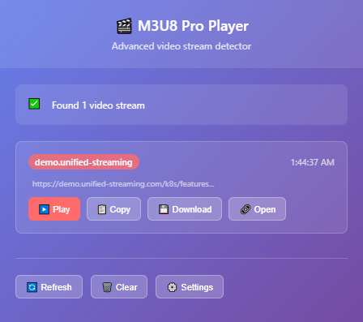

# 🎬 M3U8 Pro Player

  

A Chrome extension that automatically detects `.m3u8` video streams on any website and lets you play them directly in **ClementZQ Player**, **PotPlayer**, **VLC**, or any custom player.  
It provides a modern popup interface with multiple features to manage and open detected streams.

---

## ✨ Features

- **Smart M3U8 Detection**  
  - Captures `.m3u8` streams from network requests (XHR, Fetch, video players).  
  - Scans page source, `<video>` tags, and dynamically added content.  

- **Popup Player Panel**  
  - Lists all detected `.m3u8` streams in the current tab.  
  - Displays subdomain, timestamp, and truncated URL.  
  - Buttons for **Play**, **Copy**, **Download**, and **Open in new tab**.  

- **Player Options**  
  - Default: **ClementZQ Web Player**  
  - **PotPlayer** (`potplayer://{url}`) and **VLC** (`vlc://{url}`) support.  
  - **Custom player URL** – enter your own, using `{url}` as placeholder.  

- **User-Friendly UI**  
  - Clean popup interface with modern design.  
  - Status indicator (scanning / found / none).  
  - Toast notifications for quick actions.  

- **Convenient Tools**  
  - Copy `.m3u8` link with one click.  
  - Download `.m3u8` playlist file.  
  - Auto-refresh stream list every 10s while popup is open.  
  - Keyboard shortcut: **Ctrl+R** to refresh streams inside popup.  

---

## 🚀 Installation (Developer Mode)

1. Clone or download this repo.  
2. Open **Chrome** → go to `chrome://extensions/`.  
3. Enable **Developer mode** (top-right).  
4. Click **Load unpacked** and select this folder.  
5. The 🎬 M3U8 Pro Player icon will appear in your toolbar.  

---

## 📖 Usage

1. Open any website with an HLS stream (`.m3u8`).  
2. Click the extension icon 🎬.  
3. The popup will show detected streams.  
4. Use action buttons:  

   - ▶️ **Play** → opens in selected player.  
   - 📋 **Copy** → copies link to clipboard.  
   - 💾 **Download** → saves `.m3u8` file.  
   - 🔗 **Open** → opens in a new tab.  

5. Configure **Default Player** in ⚙️ Settings.  
   - Choose ClementZQ, PotPlayer, VLC, or Custom.  
   - For custom players, use `{url}` placeholder (example: `https://my-player.com/?stream={url}`).  

---

## 🔑 Permissions Explained

- `webRequest` → Detect network requests containing `.m3u8`.  
- `tabs`, `activeTab`, `scripting` → Popup and content script communication.  
- `storage` → Save user settings (default player, custom URL).  
- `<all_urls>` → Detect streams on any website.  

---

## ⚠️ Notes

- Some sites may block external playback due to CORS or DRM.  
- PotPlayer and VLC protocol links (`potplayer://` / `vlc://`) require those apps installed.  
- This extension is for **personal and educational use only**. Please respect streaming site terms.  
